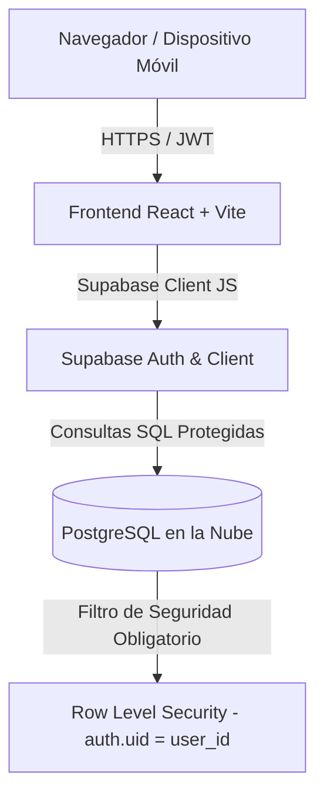

# 📱 Gestión de Ventas Google Pixel - Dashboard Promotores 🚀


Aplicación web moderna y segura diseñada para **promotores de ventas del ecosistema Google Pixel** (Smartphones Pixel, Pixel Buds, Pixel Watch y Accesorios). Permite registrar transacciones, consultar inventario en tiempo real y analizar el rendimiento de ventas con la máxima seguridad en la nube.

---

## 🌟 Características Principales

- 🔐 **Autenticación Segura**: Registro e inicio de sesión individual mediante **Supabase Auth**.
- 🛡️ **Row Level Security (RLS)**: Cada promotor accede única y exclusivamente a sus propias ventas e inventarios.
- 📱 **Catálogo & Inventario Pixel**: Control de existencias por categorías (*Pixel Phone, Pixel Buds, Pixel Watch, Accesorios*), SKU y precios recomendados.
- 🛒 **Registro de Ventas en Tiempo Real**: Registro de ventas con deducción automática de stock en el inventario.
- 📊 **Dashboard Analítico**: KPIs con totales de ingresos, unidades vendidas, distribución por familias de producto y gráfico de actividad.
- 📄 **Exportación de Datos**: Descarga instantánea de informes de ventas en formato **CSV**.
- 🎨 **Diseño Material You / Google**: Interfaz rápida, limpia, responsive e inspirada en la línea gráfica de Google Pixel.

---

## 🏗️ Arquitectura y Tecnologías



- **Frontend**: React 18, Vite, TypeScript, Tailwind CSS, Lucide Icons.
- **Backend / Cloud**: Supabase (PostgreSQL, Supabase Auth, Row Level Security).
- **Seguridad de Datos**: Variables de entorno (`.env`) excluidas en `.gitignore`.

---

## 🔒 Ciberseguridad y Políticas RLS

Toda la base de datos está protegida mediante políticas de **Row Level Security (RLS)** en Supabase:

```sql
-- Ejemplo de política aplicada en Supabase
CREATE POLICY "RLS_ventas_select" ON public.ventas
    FOR SELECT TO authenticated 
    USING (auth.uid() = user_id);
```

> ⚠️ **REGLA DE ORO DE SEGURIDAD**: Nunca expongas la clave `service_role` (`secret`) en tu código frontend. La aplicación utiliza exclusivamente la llave **`anon` (`public`)**, garantizando que RLS sea evaluado en cada petición.

---

## 🚀 Guía de Instalación y Uso Local

### 1. Clonar el Repositorio
```bash
git clone https://github.com/RicardoRdrgz/gestion-ventas-pixel.git
cd gestion-ventas-pixel
```

### 2. Instalar Dependencias
```bash
npm install
```

### 3. Configurar Variables de Entorno
Crea un archivo `.env` en la raíz del proyecto basándote en la plantilla `.env.example`:

```env
VITE_SUPABASE_URL=https://tu-proyecto.supabase.co
VITE_SUPABASE_ANON_KEY=tu-anon-key-aqui
```

### 4. Configurar la Base de Datos en Supabase
Ejecuta el script SQL [`supabase_schema.sql`](./supabase_schema.sql) en el **SQL Editor** de tu consola de Supabase para crear las tablas y activar RLS.

### 5. Iniciar el Servidor de Desarrollo
```bash
npm run dev
```
Accede desde tu navegador a `http://localhost:3000`.

---

## 📁 Estructura del Proyecto

```text
gestion-ventas-pixel/
├── src/
│   ├── components/
│   │   ├── AuthModal.tsx          # Modal de inicio de sesión / registro
│   │   ├── DashboardOverview.tsx  # Métricas y KPIs principales
│   │   ├── InventoryManager.tsx   # Gestión de stock y productos Pixel
│   │   ├── Navbar.tsx             # Navegación y perfil de usuario
│   │   └── SalesManager.tsx       # Registro de ventas y exportación CSV
│   ├── context/
│   │   └── AuthContext.tsx        # Estado de sesión reactivo con Supabase
│   ├── lib/
│   │   └── supabase.ts            # Cliente Supabase validado de forma segura
│   ├── types/
│   │   database.types.ts          # Interfaces TypeScript del modelo de datos
│   ├── App.tsx                    # Layout principal y enrutador
│   └── main.tsx                   # Punto de entrada de React
├── .env.example                   # Plantilla pública de variables
├── .gitignore                      # Exclusión de secretos y node_modules
├── supabase_schema.sql            # Script SQL oficial con RLS
├── tailwind.config.js             # Tema personalizado Google Pixel
└── vite.config.ts                 # Configuración de Vite
```

---

## 🌐 Despliegue Gratuito en la Nube

Para acceder a la aplicación desde tu teléfono móvil o fuera de tu red local:

1. Conecta este repositorio con **[Vercel](https://vercel.com)**, **[Netlify](https://netlify.com)** o **[Cloudflare Pages](https://pages.cloudflare.com)** (todos 100% gratuitos).
2. Añade las dos variables de entorno (`VITE_SUPABASE_URL` y `VITE_SUPABASE_ANON_KEY`) en el panel del hosting.
3. ¡Obtendrás una URL HTTPS pública accesible desde cualquier lugar sin coste alguno!

---

## 📄 Licencia

Este proyecto está bajo la licencia MIT. Libre para uso personal o comercial de promotores Google Pixel.
