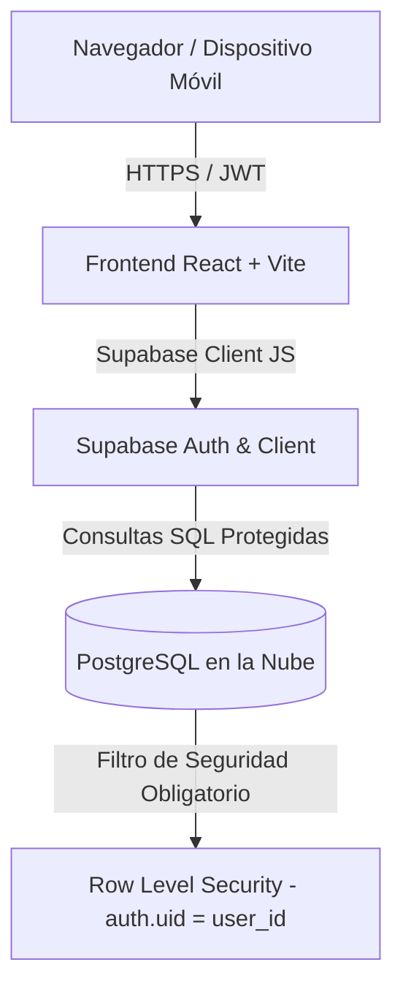

# 📱 Gestión de Ventas Google Pixel — Dashboard de Promotores 🚀


Aplicación web moderna, **oscura y segura** diseñada para **promotores de ventas del ecosistema Google Pixel** (Smartphones Pixel, Pixel Buds, Pixel Watch y Accesorios). Permite registrar ventas, gestionar catálogo e inventario, hacer seguimiento de objetivos, incidencias, reuniones y gastos — con máxima seguridad en la nube y acceso exclusivo por usuario gracias a **Row Level Security (RLS)**.

---

# 🚀 PARTE 1 · Uso para Promotores

## Acceso de Promotores — ¡No necesitas instalar nada!

Abre la web desde tu **móvil o laptop** (navegador Chrome o Safari), **regístrate y empieza a trabajar**. No hace falta descargar ni instalar ninguna aplicación.

**🌐 URL de acceso:** `https://gestion-ventas-pixel.vercel.app`

**Cómo empezar en 3 pasos:**

1. Abre la URL de acceso.
2. Toca **"Crear cuenta de Promotor"** e introduce tu correo y una contraseña (mínimo 6 caracteres).
3. Revisa tu **bandeja de entrada**: ábrelo y pulsa el **enlace de confirmación** del correo que recibas (¡imprescindible para activar tu cuenta!).

¡Ya puedes iniciar sesión y registrar tus ventas, objetivos, incidencias y gastos!

**Solución rápida de problemas:**
- **"No me deja entrar"**: asegúrate de haber pulsado el enlace de confirmación del correo.
- **"Olvidé mi contraseña"**: usa la recuperación; el sistema te pedirá crear una contraseña nueva antes de entrar.
- **"No veo mis datos"**: cada promotor ve únicamente sus propios datos (por seguridad). Si te falta algo, contacta con el administrador.

---

## 🌟 Características Principales

- 🔐 **Autenticación Segura**: Login y registro individual con **Supabase Auth** + confirmación de email.
- 🛡️ **Row Level Security (RLS)**: Cada promotor accede única y exclusivamente a sus propios datos.
- 🎨 **Tema Oscuro**: Interfaz inspirada en la línea gráfica de Google, responsive (sidebar desktop + barra móvil).
- 🔔 **Alertas Automáticas** (campanita): objetivos pendientes, formularios por cumplir, reuniones de la semana, incidencias abiertas y gastos sin registrar.

---

## 🗂️ Módulos del Dashboard

| Ruta | Módulo | Funcionalidades |
|------|--------|-----------------|
| `/` | **Panel** | KPIs del mes, cálculo de **comisiones** (3 ventas libres + tope de 14), ventas de hoy y del mes, gastos del mes, incidencias abiertas, top productos, objetivos activos y **TSM automático por zona** |
| `/ventas` | **Ventas** | Listado con filtros, ventas **multi-ítem**, estados (completada / reserva / cancelada / devuelto), clientes, eventos y botón **Reservas Google Pixel** |
| `/ventas/nueva` | **Nueva Venta** | Formulario de alta con detalle de productos e importes |
| `/ventas/:id` | **Detalle Venta** | Consulta y edición de una venta + gestión de eventos |
| `/catalogo` | **Catálogo** | Pestañas: **Productos/Inventario**, **Clientes**, **Promotores**, **Tiendas** y **Superiores por zona** |
| `/formularios` | **Formularios** | Frecuencia diaria/semanal/mensual/única, enlace externo, marcar como cumplido y lista de pendientes |
| `/reuniones` | **Reuniones** | Título, fecha, enlace Meet, descripción, notas y **puntos clave** (sin transcripción) |
| `/objetivos` | **Objetivos** | Checklist, prioridades, botón **"Analizar prioridades"** (reglas locales), historial semanal y objetivos fijos |
| `/incidencias` | **Incidencias** | Registro con tienda/promotor autocompletados, **TSM automático** e **informe mensual por email** (mailto) |
| `/tickelia` | **Tickelia / Gastos** | Doble sistema **Tickelia/Sodexo**, resumen del mes, **aviso de límite del día 19** y proyecto **GOOGLE GEMS** |
| `/guia` | **Guía / Pautas** | KPIs, normas de Tickelia y contactos de referencia |
| `/configuracion` | **Configuración** | Datos personales (zona → **TSM automático**), enlace de reservas y **cambio de contraseña** |
| `/reset-password` | **Reestablecer contraseña** | Pantalla obligatoria que fuerza un nuevo password tras una recuperación de cuenta |

---

# 🔧 PARTE 2 · Para Desarrolladores

## Requisitos previos

- **Node.js** (v18 o superior) y `npm`.
- Una cuenta en **[Supabase](https://supabase.com)** para la base de datos y autenticación.
- (Opcional) Una cuenta en **[Vercel](https://vercel.com)** para desplegar la app en la nube.

---

## 🚀 Guía de Instalación y Uso Local

### 1. Clonar el Repositorio
```bash
git clone https://github.com/RicardoRdrgz/gestion-ventas-pixel.git
cd gestion-ventas-pixel
```

### 2. Instalar Dependencias
```bash
npm install
```

### 3. Configurar Variables de Entorno
Crea un archivo `.env` en la raíz del proyecto basándote en la plantilla `.env.example`:

```env
VITE_SUPABASE_URL=https://tu-proyecto.supabase.co
VITE_SUPABASE_ANON_KEY=tu-anon-key-aqui
```

> 🔒 Este archivo está excluido del repositorio mediante `.gitignore`. **Nunca** subas tus claves.

### 4. Configurar la Base de Datos en Supabase
Ejecuta el script SQL [`supabase_schema.sql`](./supabase_schema.sql) en el **SQL Editor** de tu consola de Supabase para crear las **20 tablas**, activar la **Row Level Security (RLS)** y los **índices** de rendimiento.

**Pasos guiados (primer despliegue o base de datos vacía):**
1. En el panel de Supabase, abre **SQL Editor** → **New query**.
2. Abre el archivo `supabase_schema.sql` del repositorio, **copia todo su contenido** y pégalo en el editor (sustituyendo el texto por defecto).
3. Pulsa **Run**.
4. Deberías ver **"Success. No rows returned"** (es el resultado esperado: el script solo crea objetos, no devuelve filas).
5. Comprueba en **Table Editor** que aparecen las 20 tablas bajo `public`: `inventario_pixel`, `clientes`, `promotores`, `tiendas`, `superiores`, `ventas`, `ventas_items`, `eventos`, `formularios`, `cumplimientos_form`, `reuniones`, `puntos_clave`, `objetivos`, `check_items`, `historial_objetivos`, `reportes_incidencia`, `incidencia_items`, `gastos` y `configuracion_usuario`.
6. (Opcional) Revisa la pestaña **Policies** de cualquier tabla: debe tener las 4 políticas `RLS_<tabla>_{select,insert,update,delete}` con `USING (auth.uid() = user_id)`.

> 💡 El script es **re-ejecutable e idempotente**: usa `CREATE TABLE IF NOT EXISTS` y `DROP POLICY IF EXISTS` + `CREATE POLICY`, por lo que puedes volver a ejecutarlo sin errores si ya se habían creado algunos objetos. Nota técnica: PostgreSQL **no** soporta `CREATE POLICY IF NOT EXISTS` (de ahí el patrón drop/create). No incluye comentarios para evitar cualquier problema de copiado/pegado desde el editor.

### 5. Iniciar el Servidor de Desarrollo
```bash
npm run dev
```
Accede desde tu navegador a `http://localhost:3000`.

---

## 🏗️ Arquitectura y Tecnologías



- **Frontend**: React 18, Vite, TypeScript, Tailwind CSS, React Router 7, Lucide Icons.
- **Backend / Cloud**: Supabase (PostgreSQL, Supabase Auth, Row Level Security).
- **Lógica de negocio**: cálculo de comisiones, TSM por zona, prioridades y resumen de gastos.

---

## 🔒 Ciberseguridad y Políticas RLS

Toda la base de datos está protegida mediante políticas de **Row Level Security (RLS)** en Supabase:

```sql
-- Ejemplo de política aplicada en Supabase
CREATE POLICY "RLS_ventas_select" ON public.ventas
    FOR SELECT TO authenticated
    USING (auth.uid() = user_id);
```

**Protecciones adicionales (OWASP / XSS):**
- **Sanitización de URLs**: solo se permiten enlaces `http`, `https` y `mailto` (reservas, videollamadas, formularios).
- **Escapado de HTML** (`escapeHtml`) contra inyección XSS.
- **Limpieza de entrada** (`cleanText`) en toda escritura de datos.
- **Sin `dangerouslySetInnerHTML`**: React escapa por defecto y se añade `escapeHtml` como defensa en profundidad.
- **Recuperación de contraseña segura**: un enlace de *recovery* **no concede acceso directo**; obliga a reestablecer la contraseña antes de entrar (CWE-287).

> ⚠️ **REGLA DE ORO DE SEGURIDAD**: Nunca expongas la clave `service_role` (`secret`) en tu código frontend. La aplicación utiliza exclusivamente la llave **`anon` (`public`)**, garantizando que RLS se evalúe en cada petición.

---

## 📁 Estructura del Proyecto

```text
gestion-ventas-pixel/
├── src/
│   ├── components/
│   │   ├── ui/                     # Sistema de diseño oscuro (Button, Card, Modal, Table…)
│   │   ├── AppLayout.tsx           # Layout con sidebar + barra móvil
│   │   ├── AlertBell.tsx           # Campanita de alertas automáticas
│   │   └── AuthModal.tsx           # Inicio de sesión / registro
│   ├── context/
│   │   └── AuthContext.tsx         # Sesión reactiva + detección de recovery
│   ├── lib/
│   │   ├── supabase.ts             # Cliente Supabase validado de forma segura
│   │   ├── api.ts                  # Capa de datos (14 APIs por módulo)
│   │   ├── business.ts             # Lógica: comisiones, TSM, prioridades, gastos
│   │   └── utils.ts                # Seguridad (escapeHtml, sanitizeUrl) y formato
│   ├── pages/                      # 12 páginas del dashboard + reset password
│   ├── types/
│   │   └── database.types.ts       # Interfaces TypeScript del modelo de datos
│   ├── App.tsx                     # Enrutador + guardas de autenticación
│   └── main.tsx                    # Punto de entrada de React
├── .env.example                    # Plantilla pública de variables
├── .gitignore                      # Exclusión de secretos y artefactos de build
├── supabase_schema.sql             # Script SQL oficial con RLS
├── vercel.json                     # Rewrites SPA para el despliegue
├── tailwind.config.js              # Tema oscuro personalizado Google Pixel
└── vite.config.ts                  # Configuración de Vite
```

---

## 🌐 Despliegue en la Nube (Vercel)

Puedes publicar la app sin pagar y acceder desde cualquier dispositivo sin tu PC encendida.

1. Conecta el repositorio con **[Vercel](https://vercel.com)** (o Netlify / Cloudflare Pages, todos gratuitos).
2. Añade las **variables de entorno** en el panel del hosting:
   - `VITE_SUPABASE_URL`
   - `VITE_SUPABASE_ANON_KEY`
3. El archivo **`vercel.json`** ya incluye los *rewrites* SPA necesarios para que rutas directas (`/reset-password`, `/ventas`…) no devuelvan 404.

**Después del despliegue, actualiza Supabase** para que los emails (confirmación y recuperación) apunten a tu URL pública:
- `Authentication → URL Configuration → Site URL`: `https://gestion-ventas-pixel.vercel.app`
- `Redirect URLs`: añade `https://gestion-ventas-pixel.vercel.app/reset-password` y `https://gestion-ventas-pixel.vercel.app/**`

---

## 🎨 Personalización de Marca

El dashboard está personalizado con la identidad **Google / Gemini / Google Pixel** (uso interno autorizado por la empresa):

- **`public/assets/gemini-logo.svg`**: símbolo de Google Gemini (estrella con degradado azul → violeta → magenta).
- **`public/assets/google-pixel-logo.svg`**: logotipo del smartphone Google Pixel (con la "G" de Google en el módulo de cámara).
- **Banner del Panel** (`Dashboard.tsx`): fondo con **degradado sutil** en tonos oscuros y el logotipo nítido de Pixel + badge de **Google Gemini Intelligence**.
- **Sidebar y cabecera móvil** (`AppLayout.tsx`): logotipo de Google Pixel sustituyendo al icono genérico anterior.
- **Pantalla de login** (`AuthModal.tsx`): logotipo de Gemini grande y central sobre un degradado a juego.

Para cambiar los logotipos, sustituye los archivos `public/assets/*.svg` por tus versiones oficiales en el mismo tamaño.

---

## 📄 Licencia

Este proyecto está bajo la licencia MIT. Libre para uso personal o comercial de promotores Google Pixel.
